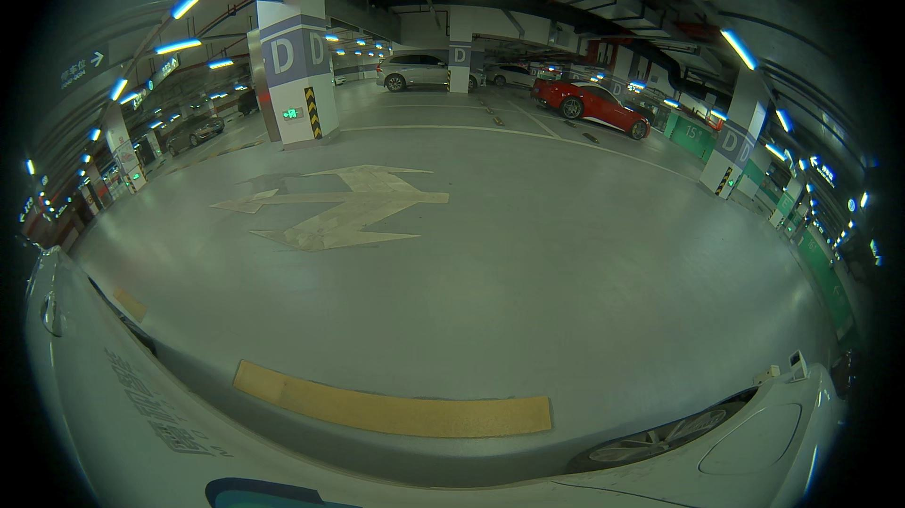
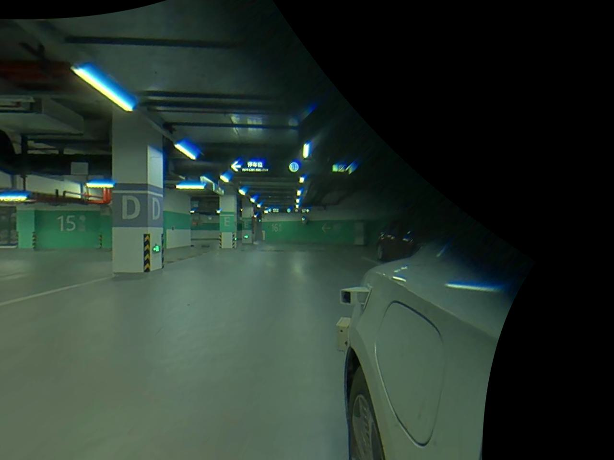

# Virtual Camera

## Install
```bash
pip install virtual_camera
```

## Instructions
### Coordinate systems
| STYLE     | X-Y-Z              |
| :-------: | :-----------------:|
| MOTOVIS   | right-forward-up   |
| openGL    | right-up-backward  |
| camera    | right-down-forward |
| pytorch3d | left-up-forward    |

### Create virtual cameras
Following are default virtual camera setups.
```python
VCAMERA_PERSPECTIVE_FRONT = create_virtual_perspective_camera((1280, 960), (-90, 0, 0), (0, 1.5, 1.5))
VCAMERA_PERSPECTIVE_FRONT_LEFT = create_virtual_perspective_camera((1280, 960), (-90, 0, 45), (-1, 2, 1))
VCAMERA_PERSPECTIVE_FRONT_RIGHT = create_virtual_perspective_camera((1280, 960), (-90, 0, -45), (1, 2, 1))
VCAMERA_PERSPECTIVE_BACK = create_virtual_perspective_camera((1280, 960), (-90, 0, 180), (0, -1, 1))
VCAMERA_PERSPECTIVE_BACK_LEFT = create_virtual_perspective_camera((1280, 960), (-90, 0, 135), (-1, 2, 1))
VCAMERA_PERSPECTIVE_BACK_RIGHT = create_virtual_perspective_camera((1280, 960), (-90, 0, -135), (1, 2, 1))

VCAMERA_FISHEYE_FRONT = create_virtual_fisheye_camera((1024, 640), (-120, 0, 0), (0, 3.5, 0.5))
VCAMERA_FISHEYE_LEFT = create_virtual_fisheye_camera((1024, 640), (-135, 0, 90), (-1, 2, 1))
VCAMERA_FISHEYE_RIGHT = create_virtual_fisheye_camera((1024, 640), (-135, 0, -90), (1, 2, 1))
VCAMERA_FISHEYE_BACK = create_virtual_fisheye_camera((1024, 640), (-120, 0, 180), (0, -1, 0.5))
```

### Convert from a real image
```python
import yaml
import virtual_camera as vc
```
1. Initialize the a camera from a real image and its calibration file.

```python
yaml_file = 'data/calibration.yml'
cfg = yaml.safe_load(open(yaml_file, 'r'))
camera_real = vc.FisheyeCamera.init_from_motovis_cfg(cfg)
```
2. Read the real image.

```python
src_image = plt.imread('data/src_image.jpg')
```


3. Convert the image to a virtual image. Alongside with mask.

```python
dst_image, mask = vc.render_image(src_image, camera_real, vc.VCAMERA_PERSPECTIVE_FRONT)
```



